###### Table of Contents
```toc
# This code block gets replaced with the TOC
```

---

I feel like there is a need for a quick disclaimer before this article. Yes in the middle of a pandemic we went on holiday, however the entire time we followed government guidelines and wore masks everywhere we went. Also this trip was booked well before anyone knew corona as anything other than beer and so with nothing cancelled this is how we got on traveling during covid-19.

Also for reference Kona lives in Japan while I live in Scotland so this was an important trip for us.

But don't worry it's not all doom and gloom, we managed to have a wonderful trip that we would love to share with you. So if you miss travel I hope you can live somewhat vicariously through us.

Tokyo → Glasgow → Killin → Rome → Naples → Sicily → London → Tokyo
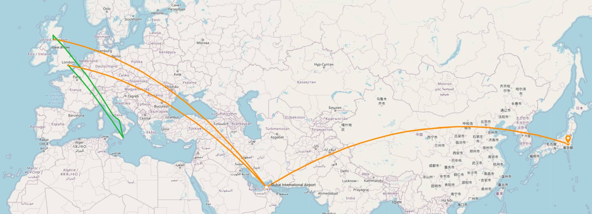

### Long distance Emirates flight

Right before Kona was about to fly over from Tokyo to Glasgow through the UAE (United Arab emirates) Emirates decided that everyone going through Dubai, even just transferring, would need a PCR test. Which makes sense, right? well yes, but they told us we needed to get one within 72 hours of departure on the week of departure!

So we had a fun few calls trying to organize a covid PCR test with a quick turn around, which trust me was not cheap. Fortunately we finally managed to get one and it was negative, phew. On with the journey. 

The flight over was actually very pleasant, it was relatively quiet and so Kona got an entire row to herself with lots of social distancing. She even received a covid safety kit with masks, hand sanitizer and everything you could need. Along with the safe knowledge that everyone on board had tested negative it made for a decently relaxing, but long, flight.

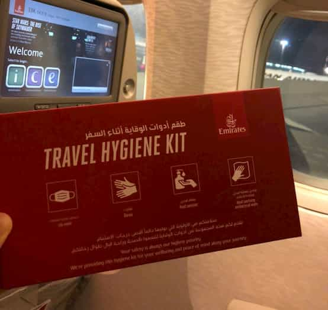

Unfortunately she forgot to take a photo of the emirates flight attendants in full covid costume. 

Where Narita aiport in Japan was silent with all shops closed and only a select handful of flights a day, Dubai international airport felt almost normal. Most of the shops were open and travelers from all around were going about their business. A very strange feeling compared to Japan.
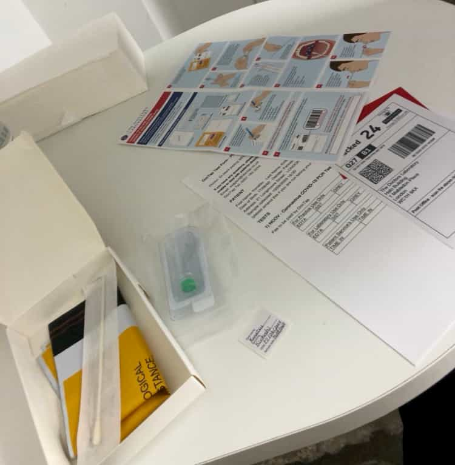

### Scotland travel

When Kona and I were finally reunited in Glasgow airport I was so relieved she had managed the long arduous journey safely.  At this point in August much of the UK was essentially back to normal, the only real difference were masks and working from home. I was very happy to be able to work from home since Kona and I were able to work together, me with work and Kona with her remaining university courseworks. 

One of the immediate differences Kona noticed here in the UK was how masks were being used. Since we are not quite so used to masks here in the West it came as a bit more of a shock to the system where in Japan they are normal even if someone has a common cold. Here they are only required indoors in public and of course on public transport with some people still slightly reluctantly using them or even using them incorrectly with their nose sticking out. Back in February just as this was all beginning I was in Japan and even back then everyone wore the masks almost without a second thought.

Other than that things were quite similar between Scotland and Japan except maybe moving slightly faster over here. One government initiative we got good use out of was "eat out to help out". In order to get the economy moving all meals at restaurants were 50% off on Monday-Wednesday which was great for us as we explored at the perfect time. 

We were even able to travel a bit inside of Scotland as we went up to Killin in the highlands for a long weekend. We had to get lifts from family members since public transport is still spotty but we managed to have a nice time away from the bustle of Glasgow. Everything felt even more normal in the countryside of Scotland and was a welcome change.

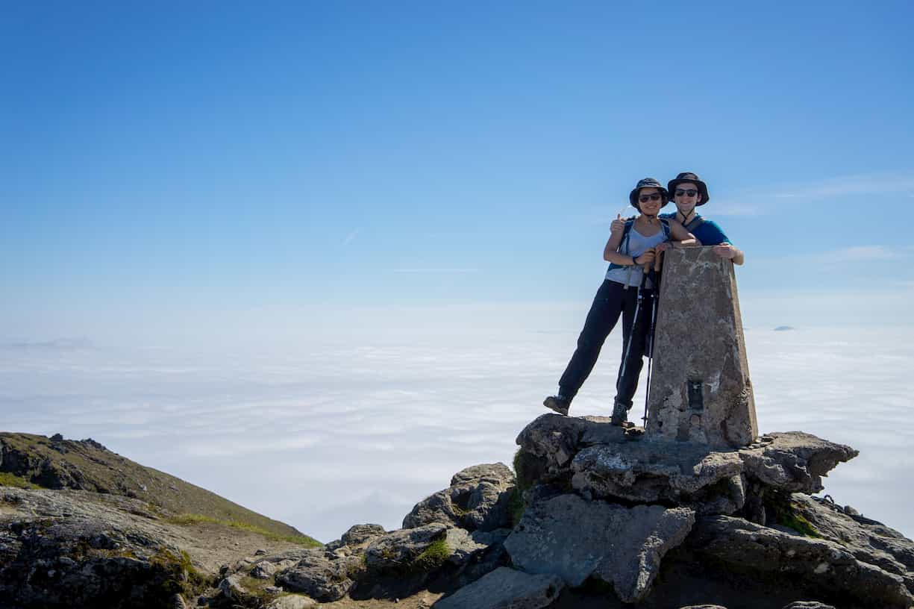

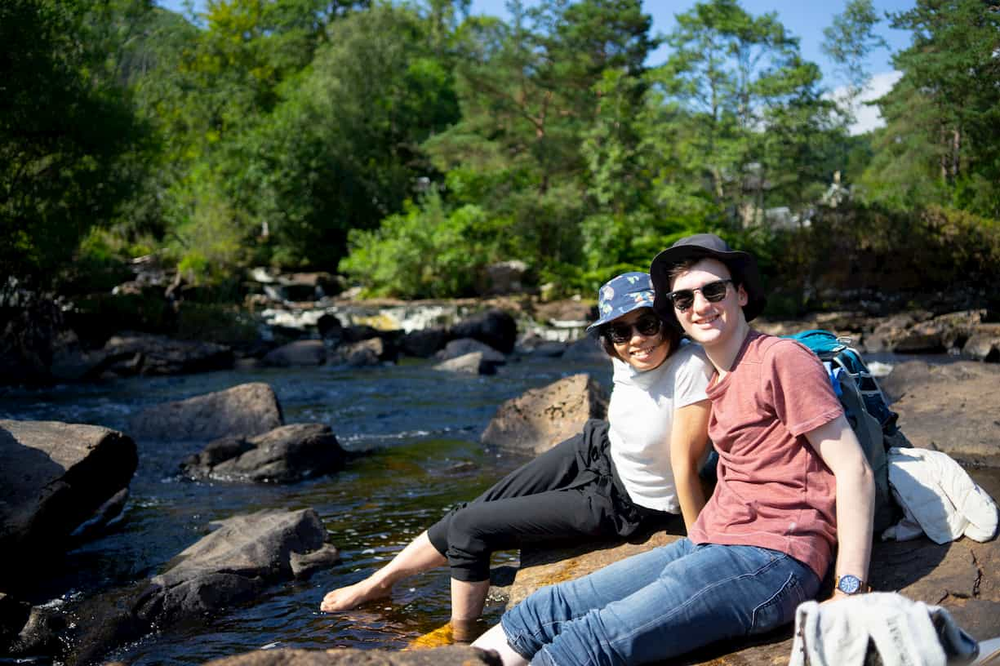

### Europe short flights

The next section of our trip was to explore Italy. Our initial flight from Glasgow was with KLM via Amsterdam, this was a lovely flight with proper social distancing throughout and we felt very safe with most people wearing masks throughout and Schipol was very easy and quick to get through. Kona even got a precious passport stamp. 


Unfortunately this high standard would not last long as the remainder of our flights were with the easyJet one of the largest budget airlines in Europe. These flights were the exact opposite and a bit of a nightmare in the midst of a pandemic. It was almost as if nothing had changed aboard the orange planes as there were almost no precautions except for poorly followed mask wearing. Some flights were not too busy and so we moved to the less crowded back of the planes, but there were a few that were completely 100% packed, something that certainly set off our anxiety having not been around that many people for over half a year. But we did manage and fortunately these were just short flights. Also we were still able to take our carry on luggage which was great news as we were traveling with only had luggage for over 2 weeks (both using Osprey farpoint 40 backpacks).

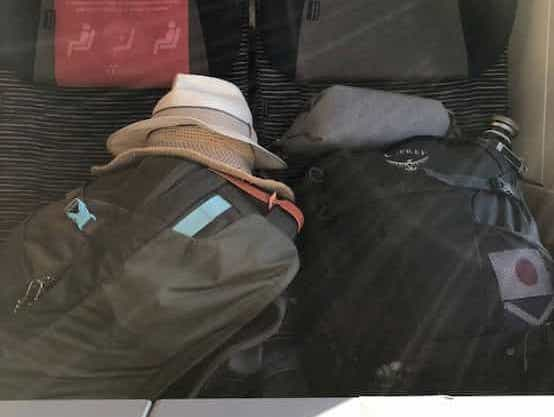

### Italy travel
If Kona had come directly from Japan to Italy she would have had to quarantine for 2 weeks but she had already been in the UK for almost a month at this point and so no quarantine was needed, we could enjoy our holiday.

At the beginning of the pandemic we saw all the photos from Italy of the deserted tourist attractions and were wondering if that would still be the case during the summer, and fortunately for us at least, it was. Although not deserted, there were certainly fewer tourists around Rome than usual. For example, we did not even have to queue to get inside the colosseum and then when we visited the Vatican we were never peeking over crowds to see any amazing pieces of art. Another particularly strange thing we noticed was the types of tourists that there were around, they were all European. I am used to seeing large tour groups from Asia or distinctly American tourists, but nope, not a single one in sight. Actually I think Kona was one of the very few non-European people around. 


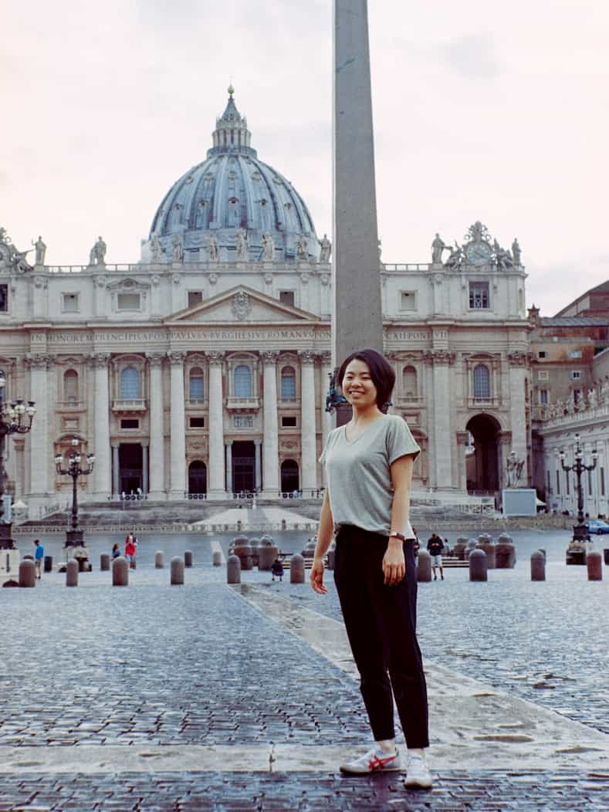

Overall precautions felt much more lax in Italy than Scotland. People wore masks but not exactly very well, with the majority being worn incorrectly around chins. Fortunately it seems in October the Italian government began cracking down on this as cases began to rise again and proper mask use appears to be better enforced now. Another slight difference was in restaurants that overall felt a lot less precautious as the old Grandmothers still rolled the pasta in the front of the shop. Although admittedly it may have been worth it for how wonderful the food was. 

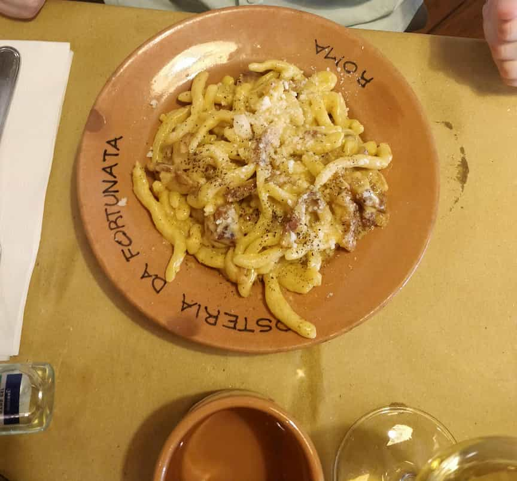

The pasta in Rome was almost other worldly and we had such a great time exploring the small side streets of Trastevere. Trust me, if you are in Rome, you have to visit Trastevere, the food and atmosphere is magical. 


Naples was certainly other worldly but maybe not in a good way. We felt as though we were launched into some crazy alternative reality with small children and entire families speeding past on motorbikes through tiny side streets. We had heard Naples was a tad grittier than Rome but that was certainly an understatement. Even our airbnb hosts suggested that Kona remove her necklace before leaving the apartment. Crossing the road felt like Russian roulette as there appeared to be no rules and graffiti everywhere. And with how busy it was I wasn't sure news of the coronavirus had made it to Naples. So we trekked through the concrete wild jungle for pizza since it was one of the few reasons we were stopping for a night, and wow, it truly was amazing, as a pizza lover it was worth it. Just maybe not again. 

But after we eventually made it to Syracuse in Sicily, we felt like we had finally escaped the crazy chaos of Naples and found a slice of heaven in the small Island of Ortigia. It felt so completely different to the rest of Italy. Again there were certainly tourists around but nowhere near as many as there would usually be which made getting restaurants a lot easier. Ortigia had, I think, the perfect atmosphere and I am glad we had a good amount of time here. Although there was not a lot to explore it was lovely to relax and take our time as well as exploring the culinary world of Sicily. The focus on seafood was perfect for Kona and I and we tried so many amazing dishes and wines, dinner was always a pleasant surprise. We stayed in a beautiful ancient stone airbnb right in the middle of the old town that was so lovely, we even had 2 cats that patrolled the area and greeted us every time we left or came home. 

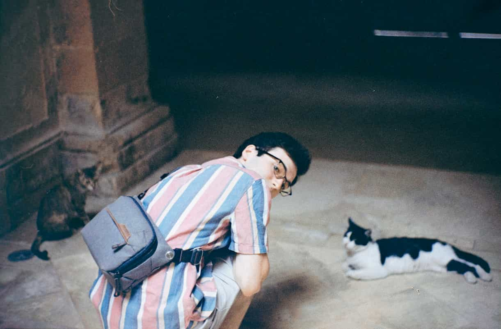

For places to eat I highly recommend 'Ristorante Sicilia in Tavola' and 'Osteria Mariano' for fantastic and authentic Sicilian dishes. And of course you can't leave Sicily without trying Canolli, and then eating your own weight in them every night for dessert, of course. 

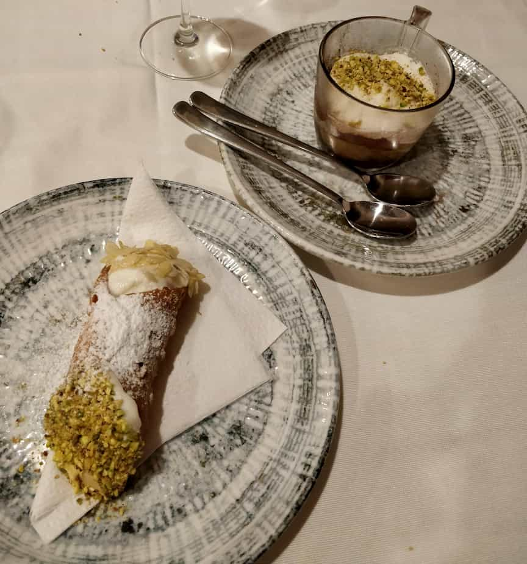

Although we didn't do a lot of exploring, we did take a day trip to hike into Cavagrande, a valley in a nature reserve with lovely pools at the bottom to swim and spend the afternoon at (the earlier you arrive the quieter). We grabbed some paninis before setting off for a long bus ride followed by an expensive taxi up to the top, then a very tiring hike to the bottom. Then on the way back we got the train from Avola to Syracuse, we were pretty surprised when it came and it was only one carriage long, we were very much in the middle of nowhere. We also managed some scuba diving with Capo Murro diving center who were great at helping us since this was our first ever dive after getting our open water licenses. Although the Mediterranean did not quite compare to the tropical waters of Amami Japan. 

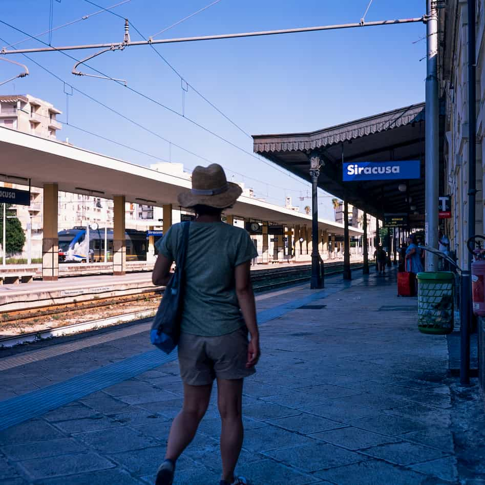

I can't think of a more perfect location to end our time in Italy, the amazing food, quaint town atmosphere, spotting moray eels and fish of all colours in the crystal blue waters by day and walking the coast by warm evening light. And during all of it the coronavirus was but a small worry in the back of our minds, except when getting paninis and fruit from a bustling crowded market.


Also small weird recommendation, but although restaurants are of course amazing, if you are a little tired like we were after diving just have an indoor picnic. We got a couple of pizzas to go from a pizzeria, amazing cured meats from a deli and a bottle of amazing local white wine. We spent a fraction fo the price and had a great evening in.

### London travel

We don't have a great comparison to pre covid London since either of us had been there before. We were lucky enough to be there right as many museums were re-opening which was great as this was most of what we wanted to visit. The British museum and natural history museum both did great jobs of social distancing and we still managed to thoroughly enjoy wandering around the one way system. Walking around the streets felt less like a pandemic as it was still fairly crowded in places and mostly just felt normal. Also, as a Scotsman it was slightly strange seeing Union Jacks (British flags) flying everywhere, I had never realized that we almost never fly them in Scotland as it is almost always the blue Saltire.


### Conclusion

Overall we had an amazing summer together and are so incredibly grateful that we managed to get this lucky when many people were not able to. We even had a better experience in many locations due to the lack of tourists and it was really special to be able to properly experience certain sights without crowds around. 

Obviously the pandemic will perhaps have it's largest impact on the tourist industry and it may be many years before we return to normalcy if we ever do. So hopefully we managed to somewhat sustain the economy of the places we visited while being as cautious as possible and following all rules. 

The rules varied a lot depending on the country as did general feelings about restrictions and so it was sometimes difficult to adapt, but it really wasn't that difficult. Flights were still a little unnerving but hopefully people can begin flying again and be open to change that needs to happen as we continue through this pandemic. 

I just can't wait until I can go back to Japan again.

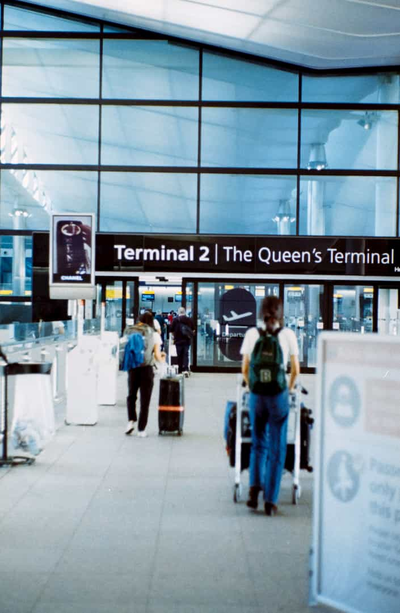