このブログのはじめに免責事項を書かせていただきます。私たちは新型コロナウイルスのパンデミックが起こるずっと前、およそ2019年10月頃にこの旅行の予定を立て、フライトを予約し、宿泊先を確保していました。そして、パンデミックが起こり世界は一変しました。しかし、政府のガイドラインに従い、手指消毒、マスク、人との距離を徹底し、この旅行を決行しました。今回は、コロナ下でどのような手続きで、どのように旅をしたのか皆さんとシェアしようと思います。

東京 → グラスゴー → キリン → ロマ → ナポリ → シチリア → ロンドン → 東京
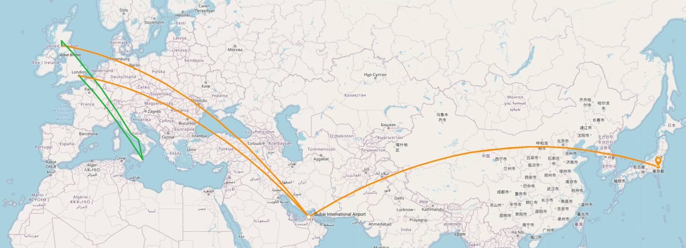

### Long distance Emirates flight
まずは、PCR検査です。

はじめに予約していたチャイナイースタン航空はキャンセルになり、最終的に利用したのはエミレーツ航空でした。「あと一週間後に出発だ！」という時にエミレーツ航空からメールが届き、出発の96時間以内に発行された陰性証明書がなければ搭乗できないというメールが突然届きました。私は大急ぎで予約をし、約4万円でPCR検査を受け英語で記載された陰性証明書を出発までに用意しました。高かったなぁ。

そして無事搭乗できた飛行機は搭乗客同士の距離を意識した席になっており、一列自分だけしかないため、行きも帰りも靴を脱いで横になることができました。

クルーは全員コロナ対策のエミレーツ特製ガウンを着ており、普段とは違うコスチュームでした。（正直写真を撮ればよかったと後悔しているのですが、不謹慎かなと思い、撮りませんでした(笑)）常に手袋、マスク、フェイスシールドをして業務をしていました。また、機内では通常の着ないアメニティーとは別に、マスク、手袋、除菌ジェル、アルコールウエットシートが入った「TRAVEL HYGIENE KIT」というものが配られました。機内放送では、できるだけ席を動かないこと、マスクを常に着用すること、新しいマスクを付け替える事、こまめな手指消毒について放送が流れていました。

また、イギリス政府は到着の（たしか）48時間前までに入国申請フォームをオンラインで済ませておく必要がありましたので、オンラインで申請しました。私が行ったときは、日本からの入国者は2週間の隔離は必要なかったのですが、到着してからどこに2週間滞在するのかを申請する必要がありました。

ロンドンから帰国する際にもエミレーツ航空を使ったので、ロンドンについてすぐ現地のクリニックで検査を予約し、陰性証明書を発行してもらいました。

ちなみに日本に到着してすぐ、飛行機を降りるときに列を作りながら、空港内のPCR検査場へ全員が行き、唾液採取による検査を受け、指定された場所で検査結果を待ちました。
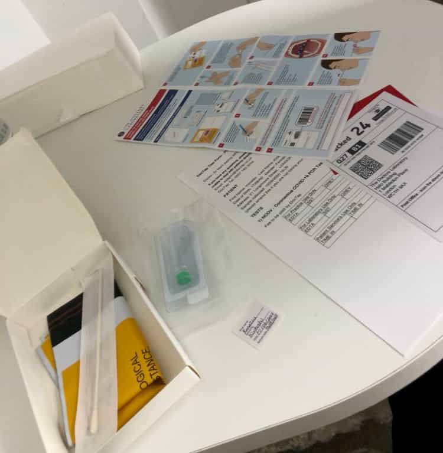

### Scotland travel

スコットランドについてから、まず気づいたのは店内に入るときのみマスクをつけるという点です。日本では、散歩やランニングでもマスクをつける方が多いと思いますが、スコットランドでは、店内に入るときにポケットから出してつけるという人が多かったです。ショッピングモールのフードコートはテーブル数を減らしていましたが、その代わりに地べたに座って食事を食べているため、テーブル数を減らすのは意味がないように思いました。ショッピングモールではそれぞれのお店の前にアルコール消毒があり、ほぼ全員が手指消毒を済ませてから入店していたと思います。しないで入店した人を見かけたら、お店の人が声をかけていました。

イギリスでは「eat out to help out」という日本でいう「Go to Eat」のようなものがありました。私は「eat out to help out」の初日から最終日までイギリス国内にいたのでありがたくその制度を使わせていただき、大変お得に食事をすることができました。日本はオンラインで事前に店舗を予約し後日ポイントがもらえるシステムですが、イギリスでは8月の間月曜日から水曜日の間加盟店舗での食事金額の合計が50%オフになるというものでした。会計時に50%オフになっているので誰でも（日本から来た私も）簡単にこの制度が利用できるので、日本の制度よりいいなって感じました。

グラスゴーでの生活からハイランド地方のキリンへの国内旅行はでは、田舎ならではのコロナ以前の雰囲気があり、なんだか安心しました。公共交通機関を利用することを避け、ロスの家族に送り迎えをしてもらいました。感謝感謝です！

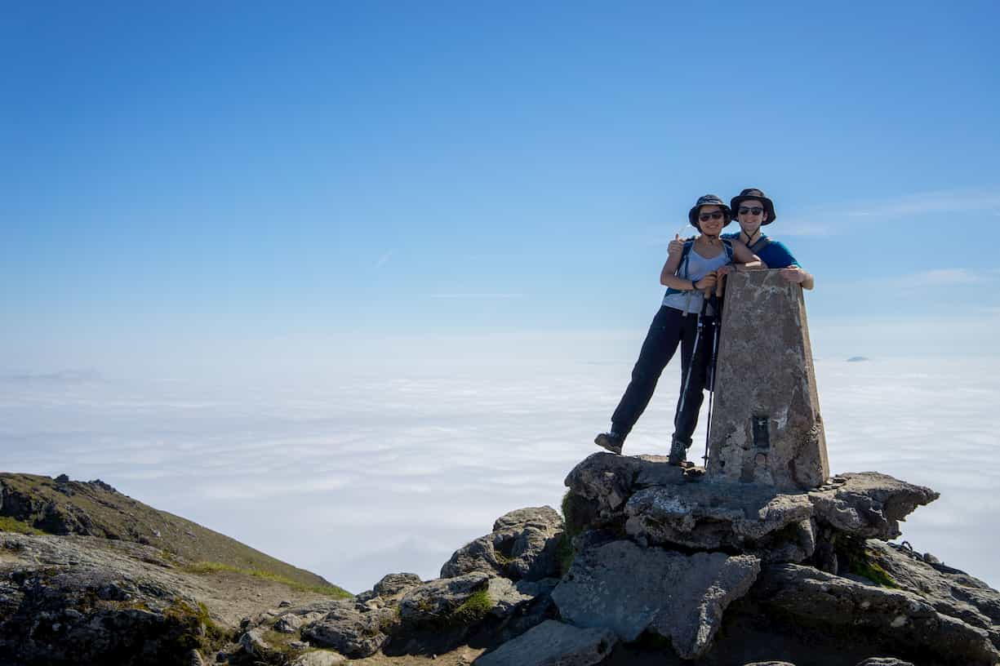

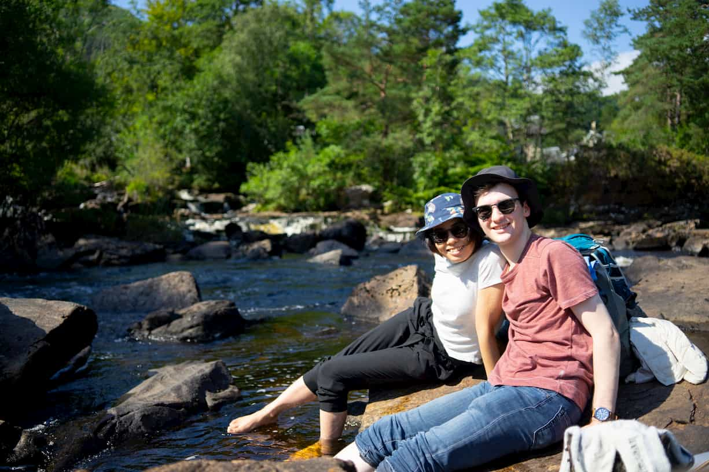

### Europe short flights

そして、スコットランドからイタリアへの旅行についてです。

コロナ下での二人そろってのフライトの一番最初は、グラスゴーからアムステルダムを経由するKLMでした。しっかりとコロナ対策がされたフライトで、乗客は少なく、十分に間隔が空けてあり、マスクの着用を強化していたため安心して移動できました。しかしその後のフライトは、ヨーロッパ最安値のeasy Jetを利用したため、ほぼ満員のフライトやマスクを正しく着用していない乗客も見られました。満員でないフライトでは後ろの空席に移動し（クルーに確認したところ「いいよー」って言ってもらえて）、意識してほかの乗客との距離を確保しました。

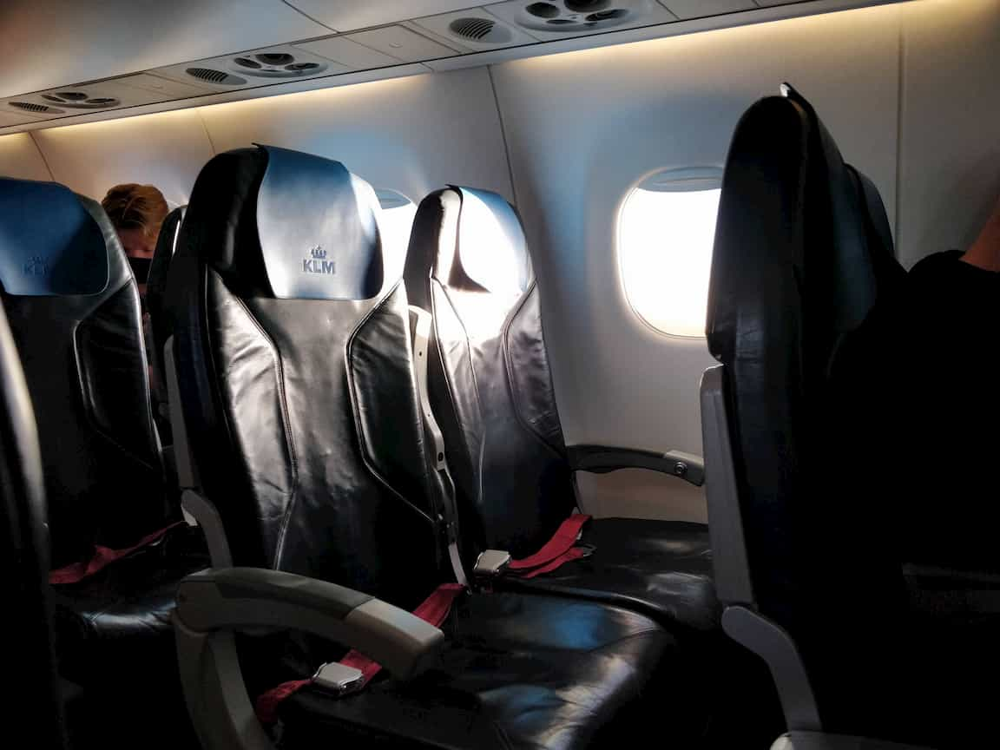

また、バックパックでの旅だったため、機内に持ち込みできるだけほかの人に触れられない様対策をしました。私たちが利用しているバックパックはOsprey farpoint 40です。

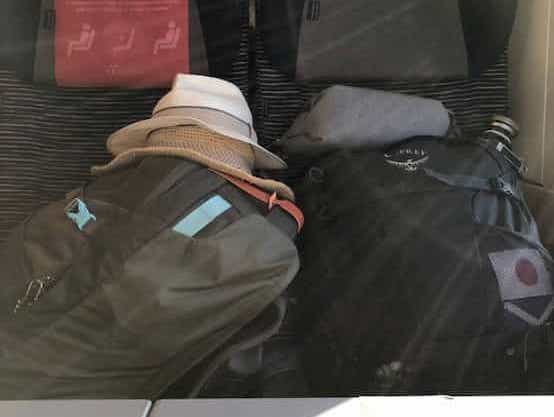

### Italy travel

日本から直接イタリアへ行くとなると、2週間の隔離が必要なのですが、私は2週間以上スコットランドに滞在したのちイタリアへ旅立ったので、ヨーロッパからの入国という扱いになり、イタリアでの隔離は必要ありませんでした。

観光客でにぎわっているはずの場所は、家族旅行などの小人数の旅行客のみで、アジアやアメリカからのツアー客は見られず、非ヨーロッパ人は私ぐらいという感じでした。

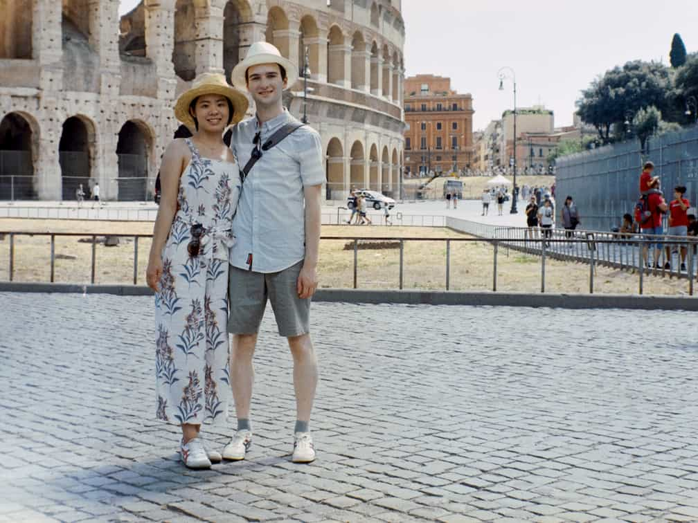

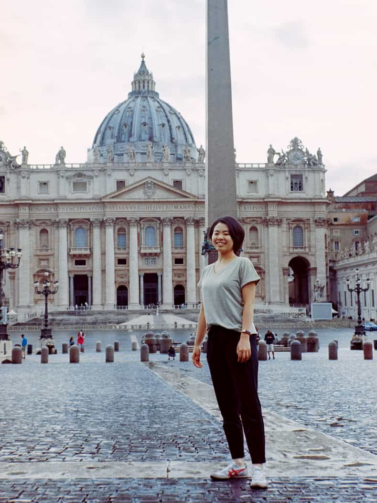

コロッセオへの入場は列もなく、トレビの泉はバリケードが立てられ水に触れることはできませんでした。ヴァチカン博物館絵では群衆もほぼ無くスムーズに歴史的作品を見ることができました。

イタリアはスコットランドよりコロナへの対策が緩い印象を受けました。マスクをしていても、あごに付けていたり、レストランの店先ででおばあさんが素手でパスタをこねていたりしました。それはそれはおいしいパスタだったのですが。。。

ローマで食べたパスタは想像以上においしかったです。トラステヴェレの小道散策はとても美しくわくわくした雰囲気があります。ローマに行くなら、トラステヴェレに行くことをお勧めします！

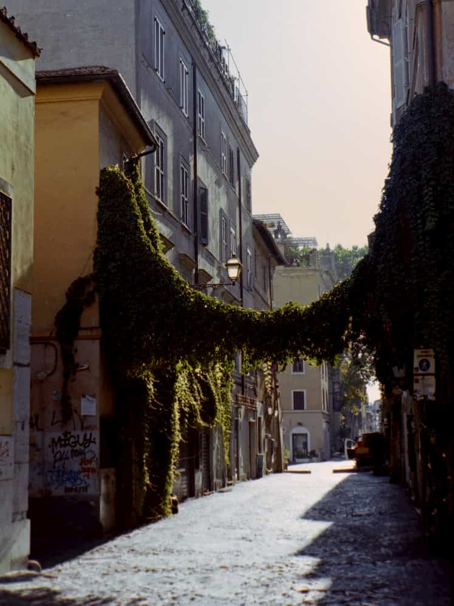

次にナポリ。ナポリへは、ナポリピザを食べることと、ポンペイに行くためだけに行ったのですが、一生忘れられない経験になりました。なぜなら、驚くほど世俗的な場所でまるで別世界に来たようだったからです。ナポリはローマより粗雑だと聞いていましたが、それはかなり控えめな表現だったと行ってみて気づきました。(笑)小学生くらいの子供がバイクに乗っているし、道を渡るのはロシアンルーレットのようなスリルがあり、細道でもスピードを落とすことなくビュンビュンバイクが通るそんな場所でした。Airbnbのオーナから外出するときはネックレスどは外して出かけることを勧められるほどでした。正直部屋の外へ出るのも恐怖心がありました。でも、ピザ愛好家のロスの希望の店へコンクリートのジャングルを通り大冒険をしました。そこで食べたピザは、危険を冒してまで食べる価値がありました。それと、ナポリにはコロナのニュースが届いていないのかなという部分も感じました。ナポリでの経験は素晴らしい物でしたがもう二度とない経験だと思います。

その後、私たちはシチリア島のシラク―サへ移動し、天国のような場所でリラックスした時間を過ごしました。ローマともナポリとも全く違ったシラク―サは私たちにとって完璧な場所でした。観光客はイタリア人とヨーロッパ人が多い印象で、混雑はありませんでした。シチリアの料理は素晴らしくおいしくて、シーフード愛好家の私にとって天国でした。おいしいワインを試し、珍しいシチリア料理を毎日見つけ、楽しくておいしくて仕方ありませんでした(笑)

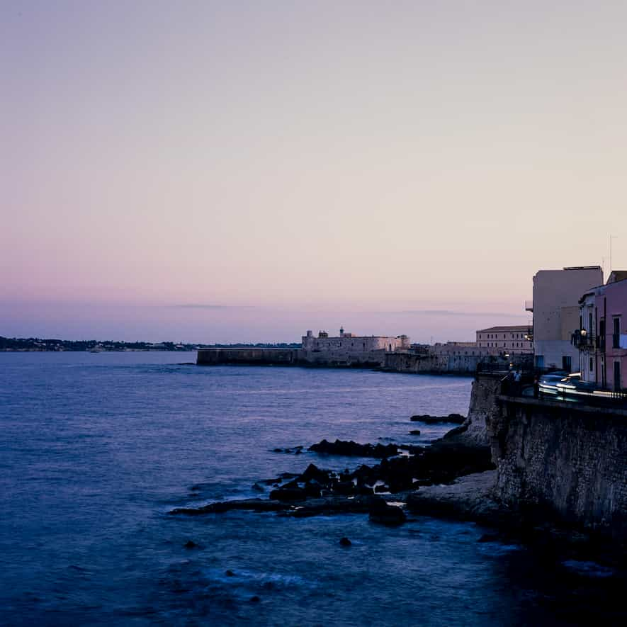

宿泊したのは、旧市街地の中ある美しい古代の石造りのairbnbに泊まりました。とても素敵で、2匹の猫がいつもその地域をパトロールしていて、出発するとき、帰宅するたびに挨拶してくれました。

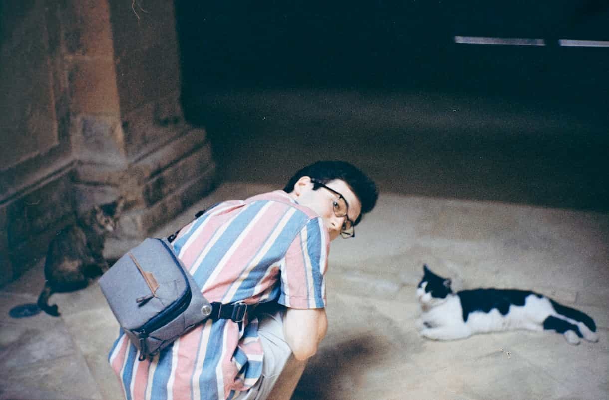

私たちのおすすめレストランは「タヴォラのリストランテシチリア」と「オステリアマリアーノ」です！幻想的で本格的なシチリア料理が楽しめます。それと、忘れちゃいけない、カノーリ！絶対食べてほしい！！外はカリッとしていて、中にはリコッタチーズが入ったスイーツです。ディナーの後にお店によって買ってその場で食べた日々が恋しいです。

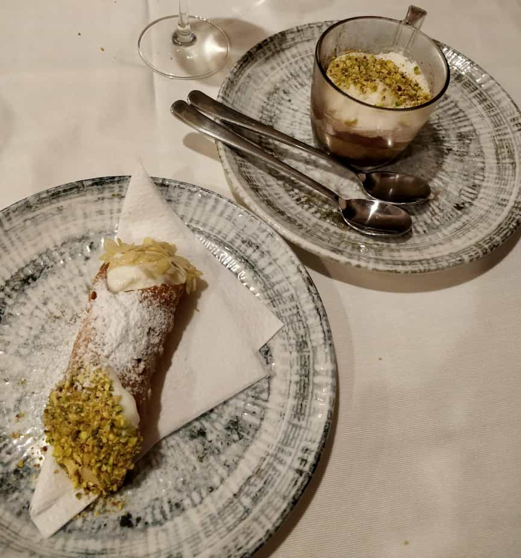

シチリア滞在中にカヴァグランデへ行きました。通常のハイキングは下から上へ上ると思いますが、ここでは私たちは上から下へ降り、下にある美しい湖で汗を流し、泳いでもっていったパニーニを食べ、のんびりして、来た道を上るというアドベンチャーをしました。泳いでリラックスした後、灼熱の中登るのは過酷でしたが、いい思い出です。

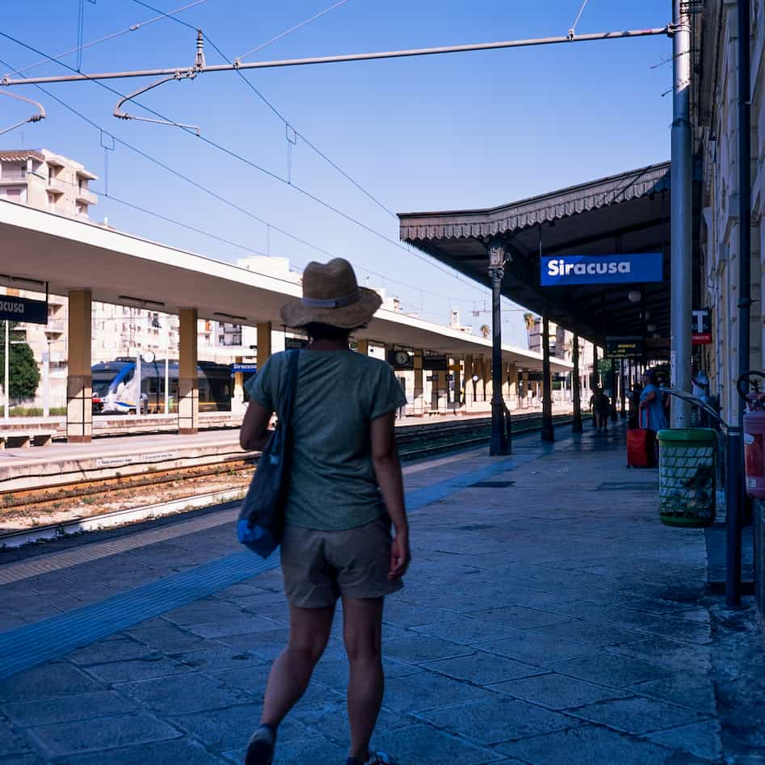

そしてダイビングのライセンスを取得後初めてのダイブをシチリア島で楽しみました。CapoMurroというダイビングセンターにお世話になりました。ロスはダイビングのライセンスを日本で取得し、私はライセンス取得後初めてのダイビングをイタリアで英語の通訳を通して行うという、なんともインターナショナルな経験をしました(笑)奄美ほど美しい海ではなかったですが、遺跡のようなものが見れて楽しかったです。

### London travel

イタリアの次はロンドン！シチリアでの天国のような日々ののち、ヒースローから成田へ帰国だったのでロンドンで数日過ごしました。

私はいイギリスに来るといつもトランジットでロンドンに上陸しますが、空港内を歩くだけですぐグラスゴーへ行ってしまうので観光をしたことがありませんでした。また、ロスもロンドンを刊行したことがなく、二人にとって初めてのロンドンになりました。パンデミックではありましたが、ロンドンの多くの博物館、美術館が9月頃から再開したため、ラッキーなことに有名な博物館、美術館を見学することができました。手で押すドアの前には大体アルコール除菌があり、取っ手を触る前と後に確実に消毒できるようになっていたり、一方通行になっていたり、人との間隔を十分にとれる等に準備されていました。街中や地下鉄には普通に人がいましたし、パンデミックというのはあまり感じることがありませんでした。

ロスは生まれも育ちもスコットランドなので、ロンドンに来てユニオンジャックが町中ではためいているのに違和感を感じたみたいです。確かに、スコットランドでユニオンジャックを見た記憶が私にもありません。

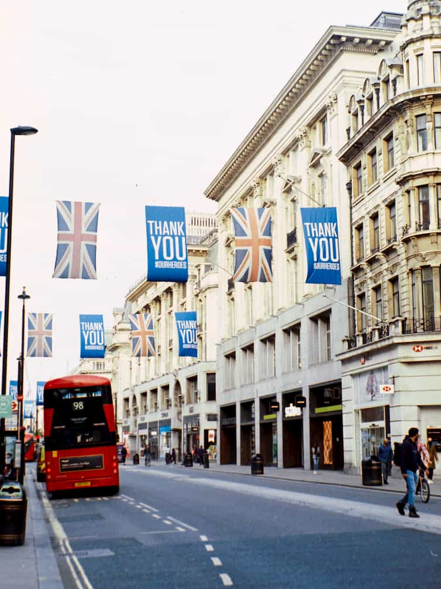

### Conclusion

まとめとして、コロナ下での旅行は多くの人ができたものではないことは確かなのですが、幸運にも私たちは安全に楽しく旅行ができました。そのことにとても感謝しています。普段は人でいっぱいの観光地もゆっくり見て回ることができました。

パンデミックにより世界中の観光業界が大打撃を受けることになり、いつ以前のように戻るかは誰にもわかりません。ですので、可能な限り慎重に、すべてのルールを守りながら、訪れた地域の経済をある程度維持することができたらいいなと思っています。

規則は国によって異なりますし、国民の意識も大きく異なるため、難しい点はまだまだありますが、今回の旅行はうまくいったと思います。フライトはまだ不安定ではありますが、パンデミックを乗り越えながら再び以前のように安全に旅をできることを祈るばかりです。

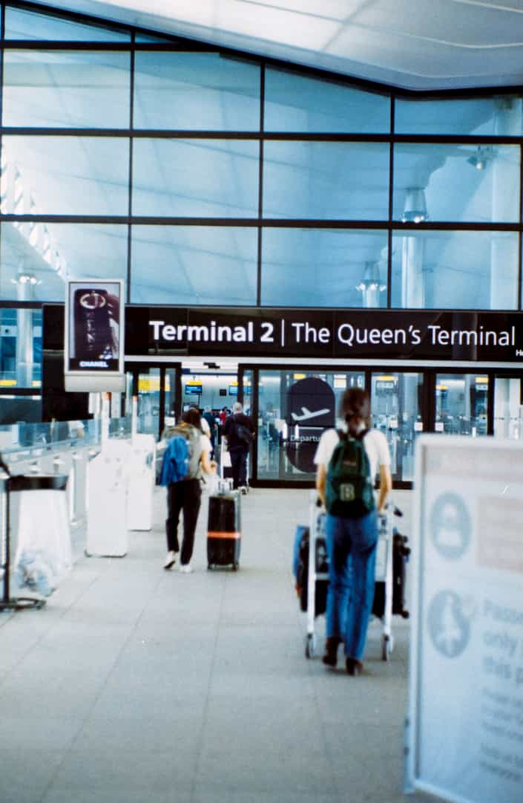