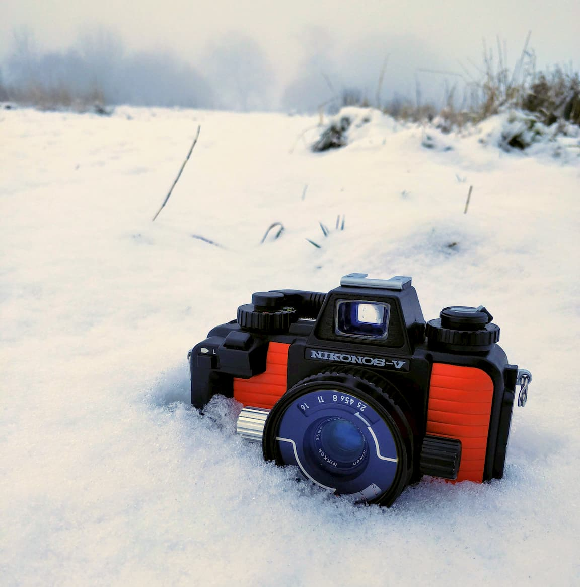

###### Table of Contents
```toc
# This code block gets replaced with the TOC
```

---

## イントロ

元々にこの記事は英語で書いたで、日本語に翻訳したけどペラペラじゃないだから完璧じゃなくて短くてごめんね

歴代の３５MMフィルムカメラにニコノスVはとても有名で、カメラの外側を見るとすぐにその理由がわかる。スキューバのために作られて、水深５０Mまで行けるカメラだでも水中だけじゃなくて、水陸両用でも本当にすごいカメラだ。

*免責事項ーこのカメラは工場から出ったばかりでも、水中に使う前にプロ手入れが必要だった。誰でも変えるO（オー）リングがあるけど、素人が手入れできないリングもある。だからプロCLAをしていなニコノスは水に入れると危ないだ。どんどん古くなっているカメラを気をつけてください。*

じゃあ、カメラについて説明します。普通のカメラみたいな鏡やレンジファインダーなし、フォーカス距離スケールを使っている、これはレンズの正面に見えることだ。これで被写界深度がわかっていてフォーカスを推測できる。だから絞りを閉じるとボケていない写真が増える。


## 水中
ニコノスを欲しがっていた理由は彼女と奄美に行く旅行だった。いっぱい海のスポーツをやるつもりだったから、透明な海にたくさん撮れそうと思っていた。

ニコノスを一度も使うとすぐに水中のためか分かれる。ボディの明るいオレンジ色は海ですぐに見つけられる。ニコノスはほとんど金属だから結構重いでも使えにくくはない。ドライスーツの手袋向きに作られているからアーゴノミックスは本当にすごいだ。大きいグリップは片手で簡単に操作できて、巻き上げレバーはミトンを着けていても操作できそう。他の本当に完璧に作ったことはファインダーだ。スキューバマスク向きから普通より遠いから見えるのは大切だからすごく大きくて眩しい。スキューバのためなんだけど、ニコンF3みたいにメガネをかける人もよく使えます。F3と似てることはそれだけじゃなくて、巻き上げレバーはニコンF3とライカM2みたいにすごくスムーズな操作がある。水中撮影は簡単な操作ではない、でもニコノスは詳しい露出計とAモードのおかげで露出設定はカメラに任せられる。

奄美旅行にPADIオープンウォーターライセンス取ったんだけどスキューバダイビングの時にニコノスを持って行ったことない。まだプロの手入れしていないから深く海で使うのは不安がある。もっと深く潜ると壊れる可能性が高くなる。

しかしスノーケリングとSUPの途中に撮影して、ものすごく楽しかった！下に一番好きな写真を付けてあります。

&zwnj;  | &zwnj;
- | -
  |  


 


## 地
でも水中撮影ばかりのために買ったわけない。どこでも冒険に持って行けるカメラに買った。奄美で以前に日本でいっぱい他の旅行した。神奈川に自転車で湘南海外沿いや、箱根の温泉も、賑やか東京も、長崎も、福岡も行った。全部の旅行にニコノスは完璧な冒険カメラだった。３５mmレンズは広くて旅行の撮影に十分、それと大雨の真ん中でも気にしなくて撮影できる。普通は旅行にカメラを持っていくと気をつけて安全に荷物に行かなきゃでもニコノスはそんな心配がないカメラだ。だから、トートバッグにさっとしまえる。この強さはハイキングの時も役に立つ。

&zwnj;  | &zwnj;
- | -
  |  

文句は一つだけ、それ小さい文句だ。レンズはちょっと遅いだ。フォーカス距離スケールを使っているだから詳しくフォーカスできません。だからレンズはf２.５だけ。フォーカスに良いけど多分ISO４００−８００が必要だ。


鏡がなくてボデイが水中できるだから音はあんまりしない。目立たないように役に立つ。

電池を使うですが、なくなるとメカニカル1/90に写真を取れる。だから田舎にいるなら心配ない。

旅行の間によくコンパクトポイントフィルムカメラみたいに使う。デジカメじゃないから旅行の終わりにすごくいっぱい写真がある訳ではなくて大切な写真しかない。コンパクトポイントフィルムカメラより重いんだけど水中できるから許す（それと、873グラムだけだ）。

つまりにニコノスVは個人的に完璧冒険カメラと言えます。

下に一番好きな写真があるのでご覧ください。

&zwnj;  | &zwnj;
- | -
  |  
  |  


## コツ

高いISOフィルムを使った方がいいだ。フォーカス距離スケールだからf/8ぐらいに撮れるともっと写真はボケなくなる。日本にいるなら絶対にプロ400hとスペリア400とヴィーナス800をおすすめする。やったことないけど、挑戦欲しいならプロビア100fは水中に本当に綺麗に撮影できると聞いた（絶対に晴れた日でなければいけない）。


OリングはまだBICカメラとヨドバシカメラに買えますがいつまで販売されているか分からな。前東京に行った時に買えた。水中撮影をする前に、リングの在庫を検索するはずだ。

## まとめ 
この記事を読んでくれて本当にありがとうございます。これは僕の初めて自分で書いた日本語の記事だ。本当にカメラと撮影と旅行大好きで今後もブログを読んでくださる方は絶対に下にあるニュースレターをご登録ください。質問などがあれば[連絡して](https://tabitraveler.com/contact)

*（それと、サイトのホームページの上写真はニコノスVで撮った）*

## リンク
* [にこのすVー英語説明書](https://www.cameramanuals.org/nikon_pdf/nikonos-v.pdf)
* [O-リング - BICカメラ](https://www.biccamera.com/bc/item/2021293/)
* [ヤフオク!](https://auctions.yahoo.co.jp/)
* [Nikonos Project](http://www.nikonosproject.com/)