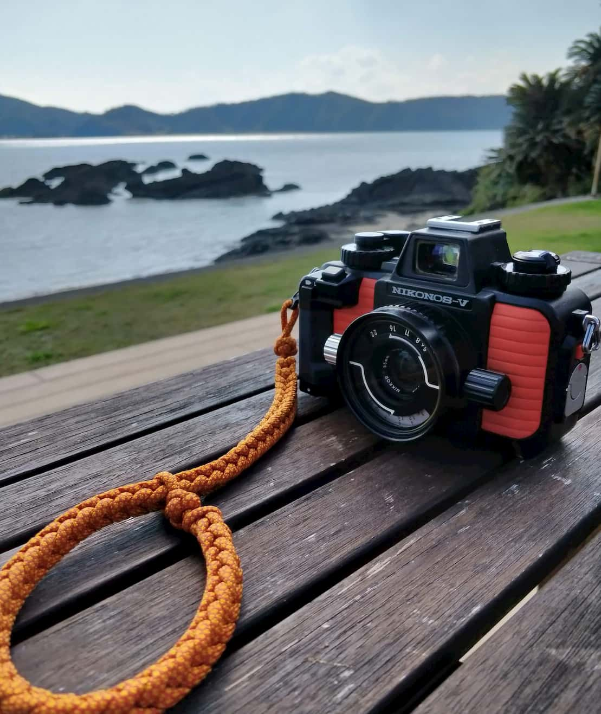
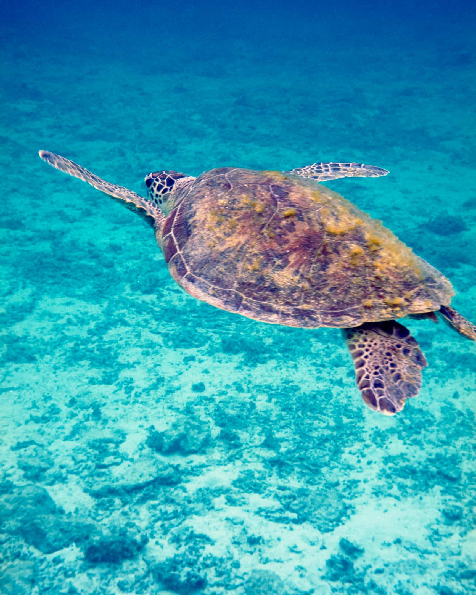
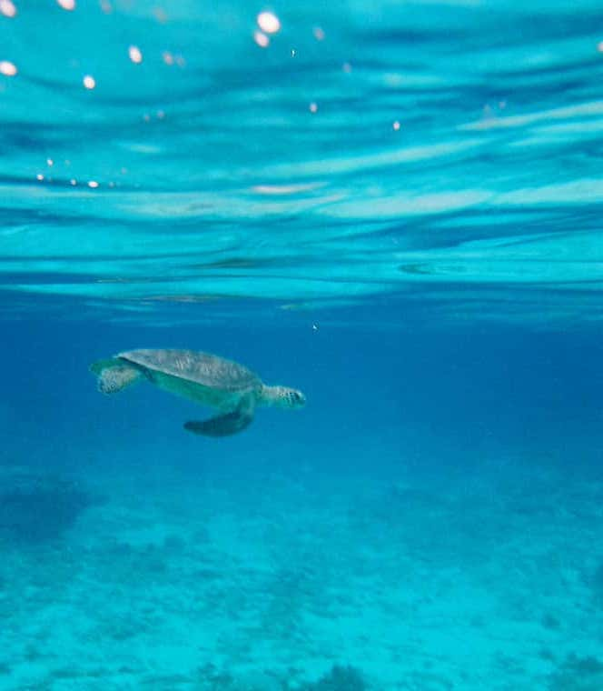
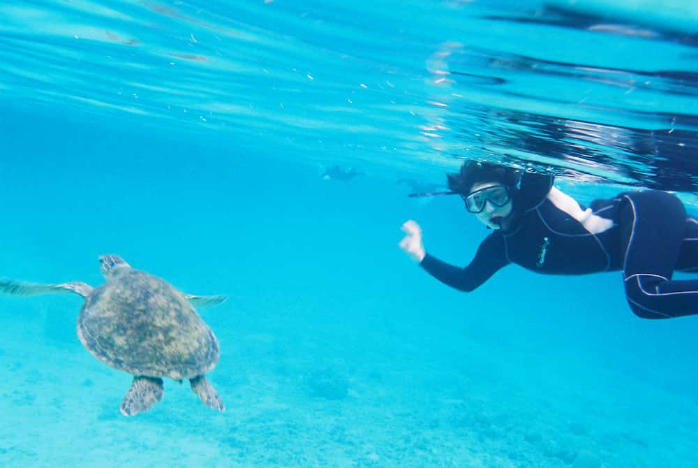
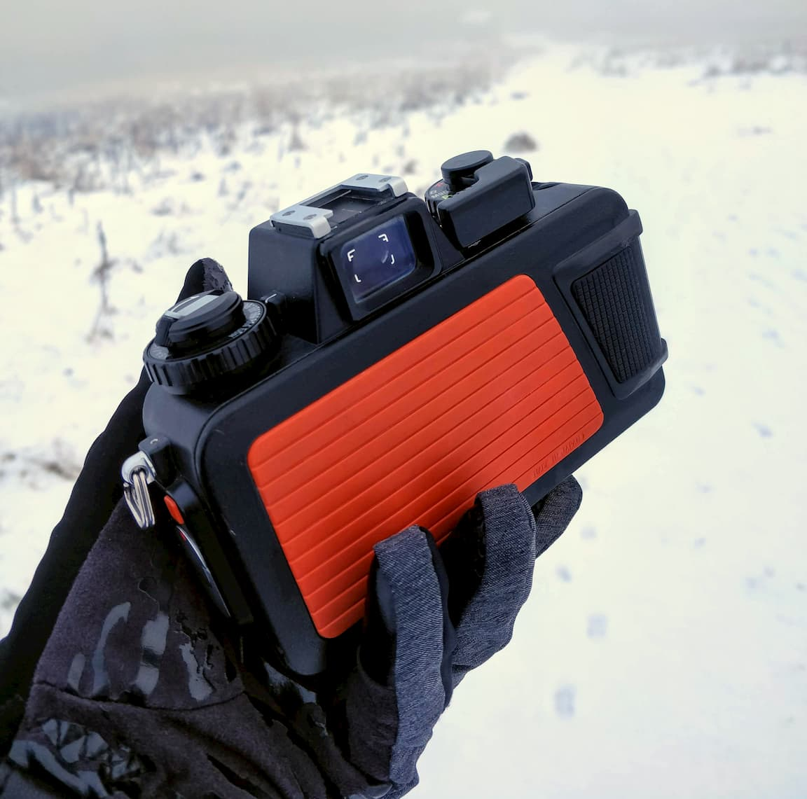
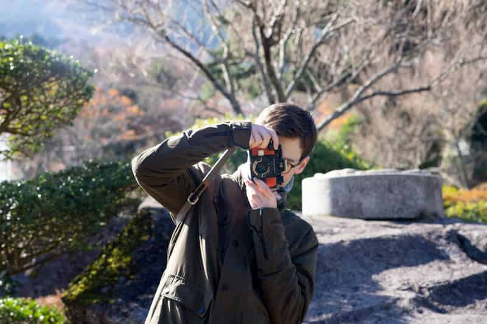
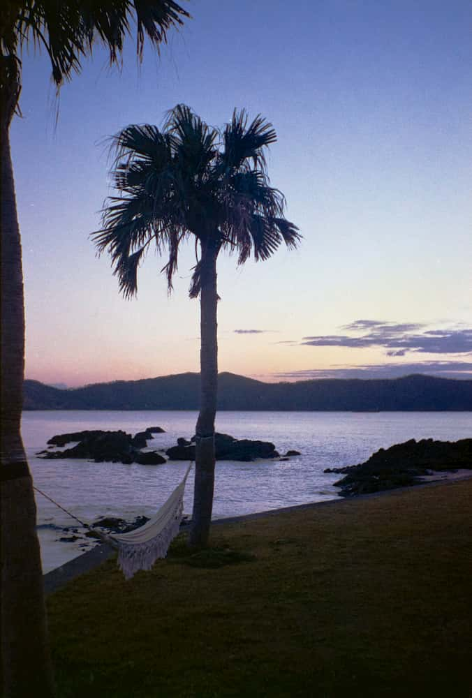
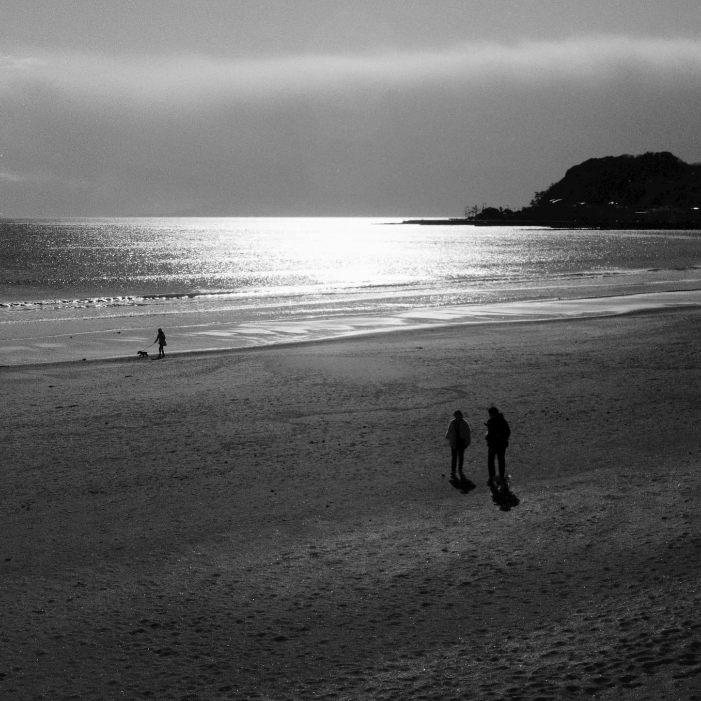

###### Table of Contents
```toc
# This code block gets replaced with the TOC
```

---

## Introduction

The Nikonos V is one of the most legendary 35mm film cameras that were ever made, with that striking orange exterior it's easy to see why. Made for scuba diving the Nikonos can go down 50 meters, covering more than enough depth for recreational divers. But that is not all the camera can be used for since it also excels above water as an all-around adventure camera. 

*Disclaimer - Quick disclaimer before moving on, these are old cameras and even at their newest out of the factory they were meant to be regularly serviced for proper waterproof performance. Although there are user-serviceable o-rings which can still be purchased, there are many only reachable by experienced technicians. And so exposing an unserviced Nikonos to water carries inherent risk. So be warned, proper servicing is advisable.*

So a little more about the camera. It uses the scale focus system, this means there is no mirror or rangefinder for focusing like in most other 35mm cameras and so the user instead has to estimate focus distances. Thankfully there is a useful depth of field scale that increases as the aperture is stopped down clearly showing what will be in focus. Of course with a system like this, stopping down will greatly increase the chance of sharp images. 
I bought my copy from yahoo auctions Japan in 2019 and have managed to use it in various situations since.



## Underwater
The main reason I had been in the market for an underwater film camera was for an upcoming trip to Amami, an island near Okinawa in Japan with my girlfriend. We planned on doing lots of water sports like scuba, paddleboarding and snorkelling and the Nikonos V seemed like a perfect fit to capture memories in the crystal clear waters.

Underwater photography is truly what the Nikonos was designed for and it shows when you use it.  The bright orange exterior, as well as looking stunning, makes it very easy to spot if you happen to drop it. And something to bear in mind if it is dropped, it will sink. The Nikonos is essentially made of of a huge chunk of metal and the weight certainly reflects this, it is a dense camera. Despite its heft, however, it is not unwieldy. Designed for use with thick dry suit gloves the camera is ergonomically brilliant. Well placed rubber pads give a great hold underwater, large "Anatomic grip" makes one handing it a breeze and large advance lever could be operated with even mittens on. Even the focus and aperture controls are designed in this way, twistable kobs extending out from the lens on either side, what a great idea for gloved use. Another fantastically well thought out feature is the viewfinder. It is by far the brightest, clearest viewfinder I have ever used. Since it was designed to be used with scuba masks in mind it is very wide and can be viewed clearly from quite some distance. This is also great for glasses users in a similar way to how the Nikon F3 High point viewfinder works. Speaking of the F3 also shares similarities in advance lever, almost reaching the legendary buttery smoothness of an F3 or even Leica M2.
Underwater photography itself is quite the experience and not the simplest activity in the world.  Thankfully the Nikonos has a great light meter and aperture priority for one less consideration to think about while holding your breath. 

Although we did get our PADI open water licences on the Amami trip, I have not taken the Nikonos diving yet. Since I have not had it professionally serviced, and only replaced the user-accessible o-rings, I did not feel comfortable taking the camera to any depths past a few meters for fear of the o-rings not being able to take the pressure.

I did, however, take it snorkelling and paddleboarding a lot and it was SO MUCH FUN! Here I'll show some of my favourite shots, I can't wait to shoot underwater more and perhaps someday get a full service to take it diving. 

&zwnj;  | &zwnj;
- | -
  |  



 


## On land
But underwater shooting was not all I bought the Nikonos for. I bought it to be an all-around durable adventure camera and that it absolutely is. Before the Nikonos was ever plunged into the ocean it travelled all over Kanagawa, from cruising the cool Shonan coast on bike to the mountainous hot spring town of Hakone, bustling Tokyo and a southern exploration of Nagasaki and Fukuoka. Throughout all of the trips so far it has performed brilliantly. The 35mm lens is perfectly wide for travel photography and the waterproof rugged nature means it doesn't need to be transported with great care, instead preferring to be chucked in a bag. Also if you are in caught in a sudden downpour the photography can continue as if nothing happened, making for a great hiking camera too. 

&zwnj;  | &zwnj;
- | -
  |  

The only slight qualm travelling with the Nikonos is the f/2.5 lens being a little slow. Because the zone focusing system though, you wouldn't want anything faster since the depth of field would be too shallow to get consistently accurate shots. Therefore it is almost always best to use 400-800 speed film for anything but the sunniest of days. 



Since there is no slapping mirror and the body is essentially a watertight brick of metal the shutter makes barely any noise other than a low thud, perfect for unobtrusive street or travel photography. Although requiring batteries for aperture priority, metering and most shutter speeds it does have a mechanical release at 1/90 of a seconds for unexpected battery failure which is a nice backup to have when away from civilisation. 

When travelling I find myself using the Nikonos much like a point and shoot. It comes with the great output film can produce along with making every shot count instead of having thousands of photos at the end of a trip. Similar to a point and shoot but without the usual drawbacks, additional ability to go underwater and the only real cost being the weight (873g, not bad).

Overall the Nikonos V perfectly fits the job title of "Adventure camera" and is an obvious choice for travel, especially when it involves getting wet. 

Here are some examples of what it can do above water:

&zwnj;  | &zwnj;
- | -
  |  
  |  


## Tips

A few tips now. For film, the faster the better, since it uses zone focusing shooting at f/8 or higher is advisable to get consistently sharp results and so ISO 400 or even 800 are great choices. I mostly used this camera when in Japan and so Fujifilm was the most available and best value option. I used mostly Pro 400H and Superia 400 as well as venus 800. However, if you are up for a challenge, I have heard Provia 100f is beautiful underwater and definitely something I want to try out of a sunny day. 


If you struggle to estimate distances then an external rangefinder is always an option. The one I have is a Watameter and it is certainly useful to get accurate measurements however I never found it fit my workflow very well with this camera and often just gets in the way. 
Another thing to bear in mind is the battery compartment. I have seen reports online that it can be very easily stripped and so it is advisable to turn left a few times before tightening clockwise to ensure it is properly threaded. 
The user-replaceable o-rings are great to stock up on whenever possible. The included grease is the intended solution and what I use however I am sure the equivalent 3rd party option will likely work too and should be purchasable from dive shops. In Japan, last I checked (2019), these o-ring sets could still be purchased as new-old stock from Yodabashi or BIC camera in Tokyo. This will eventually run out as it is no longer manufactured so eBay may be the better option. The o-rings should be inspected and regreased before using underwater. 

## Conclusion 
Thanks for reading my review/thoughts on the Nikonos V. I love this camera and can't wait to use it more, hopefully, someday diving. If you have any questions [contact me](https://tabitraveler.com/contact), check out some Nikonos shots over on our Instagram and subscribe to our newsletter below for non-algorithmic notification of what we are up to, new blogs about cameras, film photography and travel. 

*(Also fun fact, the hero image on our home page was taken on the Nikonos in Amami)*

## Links
* [Butkus Nikonos V manual](https://www.cameramanuals.org/nikon_pdf/nikonos-v.pdf)
* [O-rings - BIC camera](https://www.biccamera.com/bc/item/2021293/)
* [Yahoo auctions (Japan only)](https://auctions.yahoo.co.jp/)
* [Nikonos Project](http://www.nikonosproject.com/)