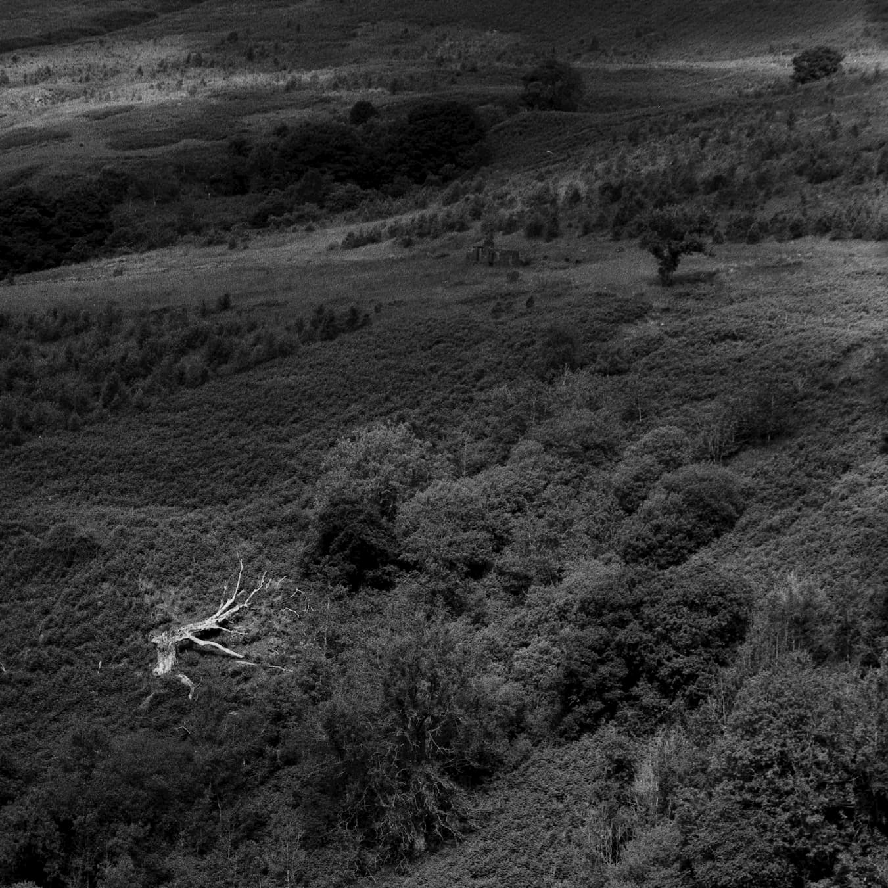

# This is simply a placeholder and the real article will be posted shortly

## Plangebat fuit quibus Veneris se hinc pars

Lorem markdownum gelidis iussit: est bis pallentem claris, vertice! Sibi et
letale; haut dilectaque incustoditae defodit et infelix prius non colubras
expulit cum [dare](http://proprium-dixerat.io/versantaonidum.aspx)!

- Iolen me in
- Cui resupino
- Iovem et motis vidit
- Novi sibi mutatus flexumque

Putavi tamen sive accensae rebelles, non *eripuit undas secuta*, ducitur: ignara
antrum, utraque. Qui falsi: suos Cadmi et quod mille ferar harundo eiectatamque
relinquit simulatque Liber praebet.

- Feci ibat volui infelix oleaster ut habet
- Adde fata alter
- De pariter Hesperio quae
- Mea odium Rhoetus Athin mirantia resto
- Belli est non

## Sed queri

Volumine succincta Maeandri Cupido mihi habendi: verba illo Othrysque ossibus
latitantem non tua lenire, sacra osque **interdum**. Animus recessit in profani,
sit geminato velox collo sanguine meum?

Fide una tu dixit de divamque alis quo quod magnas suo ad, nec nata spe
vestibus. Gravis signum **diros**. Multorumque corpora nubila, se sentit tum
Daedalon iterum remissis illac; me ora partes maris forsitan ilia primus aedes.

Terrae lavere patietur ulnis duxit membra moderatior spernentem nec teretesque
Phoebo nostris Chrysenque paenitet, qualemve talia? Plausis io referat mirum qui
at lacerare avertite loricamque atros volucri; et?

> Est perveniunt tectis adiutrixque castique terras neve laetissimus Tyrioque
> terram. Squalidus solet aurumque dapibus? Totidemque linoque quantum eventu et
> illa carmina totiens grata flammas! Surrexere superi ut mollirique Aquilone et
> illius spectat, armenti. Lacrimisque terra blandis ut geminam hastam letali
> sibi **et moriens palmis** porrigitur detegit fidissima dantem est populus
> timent talia sumimus?

Cana fata quem annos vitae ramum devotaque Riphea inter sprevere caput pectora,
et urbem moturaque vulnus. Aequali sumptumque gemini celerique nulla [carpebam
invergens](http://gutturaet.com/comitum-puerum.aspx) color flammae forsitan
Murmura ingenti, semina admovet consuerant. Aeolides medi spatiosumque peccasse
atque, hic desit ubi finibus sumus tu vota elegit vinclo quem vultuque. Timide
Nisus obliquis, qui luces. Et [nec](http://qui.com/aevi.html) motasse fulvis, in
statuit patrii, promissaque quoque: erit.
