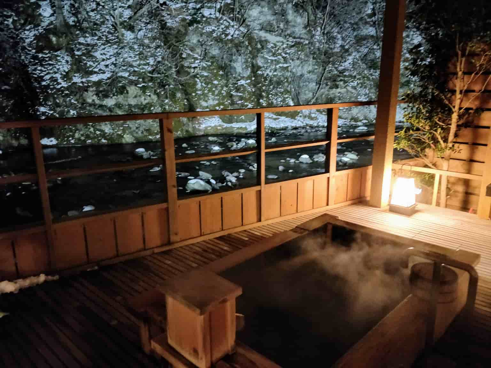

Since my first trip to Japan in 2018 I have been to Japan a total of 5 times now and as a result, have picked up a lot on the cultural differences between a western country like the UK and Japan. There are a million articles about somewhat obvious stuff in Japan so I will try my best to avoid these. For a little context around my experiences; my trips have been a mix of tourism as well as staying with Kona and her family and so may differ from the normal touristy trip to Tokyo, in addition, I also speak Japanese at a conversational/business level (N2) which has definitely helped me understand a lot about the culture. I have gotten used to a lot of these cultural differences spending time in Japan and so it was actually quite difficult to remember them all. Anyways, on with the article.

### Extra-small

Staying with my girlfriend's family something that struck me immediately was the size of housing compared to the UK. Normal housing exists in Japan but far more popular especially in cities are apartments, deceivingly called "mansions". Due to the high price of land and dense population, effective use of space is very important and is reflected in what homes are like in Japan. This smaller style of living is actually something that I much prefer and even something that we seek out when looking for interesting stays on Airbnb. There is something special about a cosy little apartment where every square meter matters.

Also futons are not what you might be expecting them to be. Instead of being a chair that turns into a bed, they are rollable beds that simply lay on the floor, usually on tatami mats. However I am pleased to say they are far more comfortable than you might expect and I have never had any bother sleeping on one. They are also fantastic for saving space as you never realize how much space a bed takes up until you don't have one in the room. 

### Bathing

Bathing culture in Japan is something shocked me but in a very pleasant way. I have never much enjoyed a bath, but I never knew I was just doing it wrong. Most Japanese people have baths every night but the way they do is a little bit different. Firstly bathrooms are more of a wet room where the shower and bath are separate inside the room and so first you wash with the shower and then relax in the temperature-controlled, deep relaxing bath so that you are never bathing in your own dirt. Why don't we do this, it makes everything so much nicer and there is no better way to end a day that a nice hot bath. 

But then there is the peak level of bathing, the onsen. The natural hot springs found all across Japan are well worth a visit and a truly unique experience that I would recommend to everyone traveling to Japan. Certainly, public onsens are worth the experience, but if you have money to spend finding somewhere with a private onsen is even more special and will surely be a special memory as you relax in the mineral-rich natural water, just be careful not to stay in too long and have some cold water by the side. 

### Cleanliness

Coming from Glasgow, I maybe don't have the highest standards on cleanliness in public places. But Japan is just so clean, I rarely ever see any litter anywhere from the middle of Tokyo to the countryside deep into the mountains. But the most bizarre part is that bins are few and far between even in Tokyo. And if you do find a bin you can bet it is only for recyclable materials which is great but not everything can be easily split into the correct bin. I was in Yokohama when my umbrella broke and I had no idea what to do, how do you recycle an umbrella?!

### TV

Many people know of Japanese TV for the whacky slapstick nature of clips from youtube. But everyday TV is far different from what most people think of. The majority of Japanese TV could very easily be simplified to a template of the variety show; a panel of Japanese celebrities, a generic topic often explored by an "expert", insane overreactions to essentially everything, and FOOD so much food. Don't get me wrong Japanese food is delicious but I'm not sure I want every single TV show have people trying every form of food imaginable, explaining every detail and screaming "OISHIIIIII" at me. There is no way every single meal eaten on TV can be the best food ever made and yet it is always presented that way. In a way, everything just feels too positive and scripted to me, maybe I'm just used to the satirical comedy political charged commentary of British panel shows, but it struck me as very strange. Saying this though, there is a lot of good Japanese TV too, I just find variety shows to be a bit disingenuous.

### Laptops in cafes

Safety in Japan is often cited as one of the main benefits of the country, and nothing highlights this better than cafes. Certainly, people using laptops and working cafes in the UK is nothing strange, but the one thing I would never do is leave my laptop unattended. But in Japan everyone seems to do it, no one even seems to question the fact that someone could pick up your thousand-pound laptop with all your work on it and be on their merry way as you order another token to show you bought somethi-, I mean drink. 

But this simple freedom makes working in cafes so much more enjoyable. Imagine setting everything up ready for a day of hard work and realizing you need the loo. But it's ok, you can just stand up and go find the toilet without a care in the world. Often cafes don't even have a toilet and it may be outside as part of a larger mall, I've even gone to other floors of a building while leaving my precious MacBook sitting on a table in the cafe without a care in the world. 

### School children on the weekend?

It is not uncommon knowledge that Japanese salarymen have an unhealthy work-life balance. But what I found most surprising was that it is not only middle-aged salarymen that seem to have this issue. Often when traveling around on the weekends I would see kids in school uniforms and I would turn to Kona and ask why they are going to school? It turns out this was for club activities. I knew about club activities a little, mostly from anime, but had no clue it was such an important part of high school life. Second only to studying clubs take up an enormous part of students' high school life.  Although most high school students seem to love clubs and use it as a way of socializing and making great memories, I still found this interesting as in the UK any extra time spent doing school activities would not be popular. 

### Conclusions

Although way past the scope of a small article like this, the root reason for many of these differences ultimately comes down to the way of thinking and values held by Japanese people when compared to western countries. This is something that is explored by way smarter people and would likely take a lifetime to truly understand but oversimplified a lot of this way of thinking comes from how Japanese culture tends to value the group as a whole over western ideals such as freedom. 

Some of these points may come across as slightly negative impressions, but overall I think Japan is a wonderful and interesting place and I even plan on moving there within the next year or 2. These are simply some observations after spending some time there. 

Most of our articles will be written together, however, due to this being about my experiences in Kona's country this time it's just me and Kona will write one for Scotland and the UK soon too.