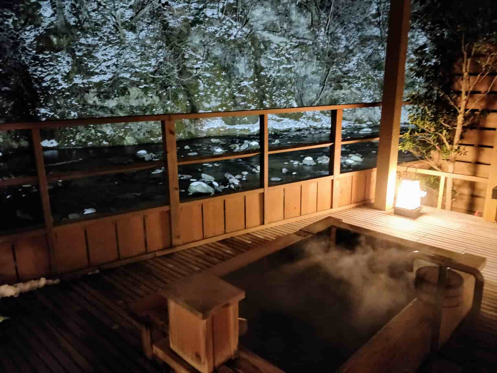

###### 目次
```toc
# This code block gets replaced with the TOC
```

---

2018年に初めて日本に行ってから、日本には合計5回訪れていて、日本とイギリス、西洋文化との違いをたくさん学んだ。日本の文化についての記事はもうすでにたくさんあるので、そういったものとかぶらないように頑張ります。

今回の内容についての補足

僕の旅行はコナに会うことと、とコナの家族に会ってコナのお家に滞在すること、そして観光することがミックスしているので通常の旅行客の東京観光とは違います。また、僕は日本語を勉強していて今はN2（日常会話やビジネスの現場で日本語が使える）レベルの日本語を理解し、話すことができます。このことは日本の文化を理解するのにすごく役に立ったと思う。

もう何度も日本に行ったことがあるから、文化の違いに慣れてしまった部分もあって、初めての時どんな文化の違いに衝撃を受けたのかを思い出しにくくなってしまったけれど、とりあえず書き始めたいと思います。

### XSサイズ

まずはじめにコナとコナの家族と一緒にいるときに気づいたイギリスと日本の大きな違いは、家の大きさです。イギリスで言う通常の住宅も日本にはありますが、特に都市部ではマンションが人気だと思った。都市は土地の値段が高く人口密度が高いから、スペースを有効活用することが大変重要。そのことが日本の住宅事情に反映されているのかなと思います。

この小さなサイズの生活スタイルはAirbnbで宿泊先を探すときに重要視するほど今では僕のお気に入りのスタイル。小さな生活空間は居心地のいい場所を作り出す特別な何かを感じるんだ。

布団はみんなが想像するよりはるかに居心地がよかった。布団は畳に敷き眠ることができて、コンパクトにしまえてスペースを節約するのにも役立つんだ。

##### 「コナのコメント」

私の家が小さいだけで、日本にもたくさん大きいお家があるし、大きな部屋のマンションもたくさんあるよ（笑）私の家を案外気にっていてくれてるみたいでよかった。

### 入浴

日本の入浴文化には本当に大きな衝撃を受けたんだけれど、すごく楽しいものだった。今までお風呂が楽しいなんて思ったことは1度もなかったんだけど、それは今までの僕のお風呂の楽しみかたが間違っていたからみたいだ。ほとんどの日本人は毎晩お風呂に入る。でもそれは僕が知っている方法とは違った。まず、バスルーム全体がぬれても大丈夫な作りになっていて、シャワーとバスタブが離れて設置されてるんだ。まずシャワーで体を洗ってそのあと自動で温度調節されたお湯のたまった深めのバスタブでリラックスする。だから、自分の汚れた体をきれいにしてからきれいなお湯で入浴することができるんだ。きれいで温かいお風呂に浸かり一日を終えられることほど幸せなことはないよ。

日本のお風呂の一番素晴らしいことは温泉だ。日本全国の天然温泉は一見の価値ありですよ。温泉は日本を旅行するすべての人にお勧めする、日本でのユニークな体験です。公共の温泉もいいけれど、多少お金をかけて楽しむプライベート温泉はさらに特別な思い出になるでしょう。

長く入っているとのぼせるので、近くに冷水を置いてから入浴することをおすすめするよ。

##### 「コナのコメント」

ロスは大きな声を出したり「オーマイガー！」とか言うタイプの人じゃないんですけど、いつだったか、お風呂場から「オーマイグンネス！！！」と叫んでる声が聞こえてきたことがあります。相当熱かったんですかね～



### 清潔感

グラスゴー出身の僕は公共の場での清潔感の基準はあまり高くは無いと思う。でも日本は本当に清潔。ただただ清潔だ。東京からその周辺の県、田舎、山の中まで行ったけれど、ポイ捨てゴミを見たことがありません。しかし、奇妙なことに東京でもゴミ箱がほとんど見当たらないんだ。もしもあなたがゴミを日本で見つけたら(絶対にないけど)、それは正しく分別してリサイクルすることができるゴミだ。横浜に出かけたときに傘が壊れてどうしたらいいか分からなくて困ったことがあった。どうやって傘をリサイクルするのかな？

##### 「コナのコメント」

初めてのデートの時大雪で、傘が2本も壊れて大笑いでした😂

### テレビ

多くの人がYouTubeで日本のテレビのドタバタ映像を見たことがあると思う。でも、日本の日常で放送されてる番組はそうじゃなかった。日本のテレビはバラエティーショーが多く、それにはいつも食べ物が登場する。日本食は本当においしいのだけれど、テレビでの食べ物に対するリアクションは、オバーすぎるよ。テレビでは食べ物を食べる際、事細かにその食べ物について説明をして、「おいしーーーーい！！」と叫ぶんだ。テレビに出てくるすべての食べ物が最高の料理であるはずないのに、日本のテレビはそう見せるんだ。ある意味それはポジティブすぎると思うし、台本があるんじゃないかと思ってしまうよ。おそらく僕はイギリスの政治批判的な風刺喜劇のテレビに慣れているだけだと思うけど、日本のテレビにすごく奇妙さを感じたよ。とはいえ、良い番組もたくさんあるけどね。

##### 「コナのコメント」

ロスの家族と初めて食事したとき、いつものように「おいしい！」って食事中に言ったんですけど、なんか「私おかしい？」と感じたのは間違いではなかった。みんなにはオーバーに見えたのかも（笑）私は無意識に日本のバラエティー番組に影響されていたのかもしれない。。。だからロスの家族は「コナは食べるの大好き」というイメージが強くついてしまったみたい（笑）

### カフェで仕事

日本の安全さはとてもよく知られた話だけれど、カフェほどそれを証明できる場所はないだろうな。イギリスでもカフェでノートパソコンを開き仕事をしている人を見かけることは珍しいことではないけれど、僕が絶対にやらないことの一つは、ノートパソコンを置いたまま席を離れることだ。ところが、日本ではそれは誰もがすることみたいなんだ。あなたの仕事の大切なことすべてが入っている、￡1000（10万円）のノートパソコンを誰かがあなたが飲み物を買っている間に盗むなんて考えてもいないみたい。

この気楽さがカフェで仕事をするのを楽しくしている要因かもしれない。心配することなくトイレにも行けるし。イギリスではよくカフェにはトイレはありませが、ショッピングモールの中にあるカフェの場合、カフェを出てモールのトイレをつかえます。


### 週末も学校？

日本のサラリーマンは不健康なワークライフバランスだと聞いたことがある人が多いと思う。この問題は働き盛りのサラリーマンだけに起きていることではないと気づいたんだ。週末に旅行に出た際に制服を着た学生をよく見かけた。それでコナに聞いてみたんだ、「なんで週末なのに学校に行くの？」って。そしたら部活があるんだってコナが言ったんだ。日本には部活があることをアニメを見ていたから何となく知っていたけれど、部活が学生生活の中でも重要なことだとはわからなかった。また部活は学生生活の大部分を占めるものだということも知らなかった。ほとんどの学生は部活が好きで、いろんな人との交流や、素晴らしい思い出ができるみたいだ。イギリスでは、学校生活に時間を費やすことはないので、日本の部活文化は興味深いなと思う。

##### 「コナのコメント」

私が高校2年生の時からロスと付き合っていて、そのころから毎日テレビ電話をしていたんだけど、毎日必ず部活での出来事を話していたと思う。特に私は部活が学生生活の中心だったタイプなので、部活の重要さをロスは理解しやすかったかもしれないな。

### まとめ

こうやって振り返ってみると、自分の文化と日本の違いを比べてみると日本人の考え方と価値観こそが西洋文化との根本的な違いだと思います。このことは専門家などが研究している部分でもあり、完全に理解するには一生かかるんじゃないかと思う。日本文化が自由などの西洋の理想よりもグループ全体を評価する傾向があることもその一つだ。それは少しネガティブな印象を受けるかもしれないけれど、日本はすごくいいところだし、面白い。近いうちに日本に住む予定だ。

僕たちの記事はほとんど二人で書いているんだけど、今回は僕のコナの国に対する体験談で、次はコナが僕の国での体験を書くよ。