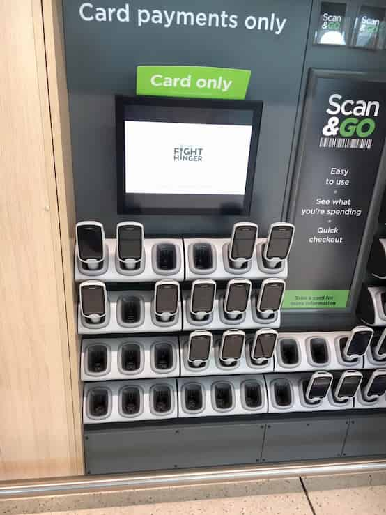
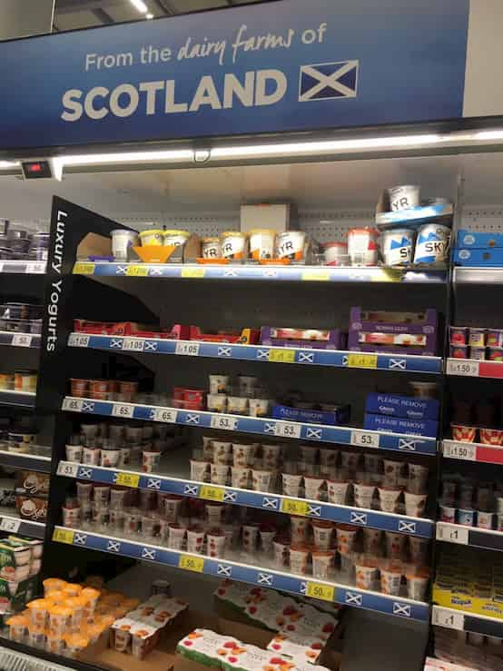
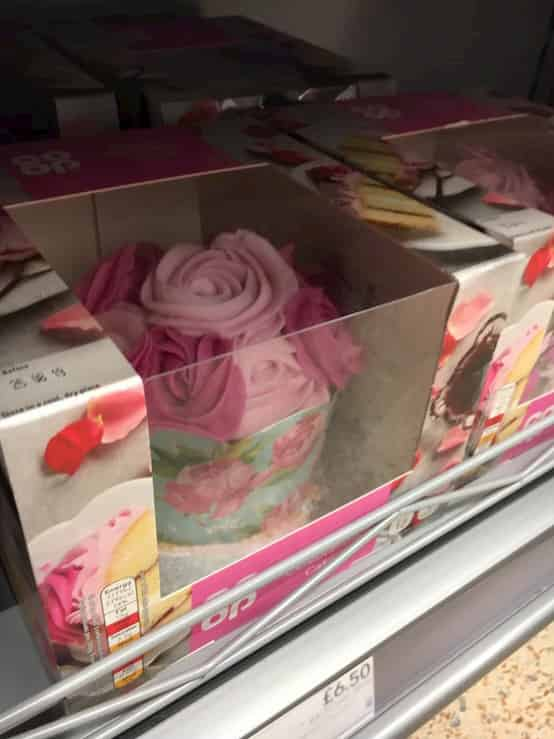

###### 目次
```toc
# This code block gets replaced with the TOC
```

---

人生で２回目の海外で、一人でスコットランドのグラスゴーへ行って、私のパートナーとその家族と過ごす1か月の中で見つけた、私的に驚いたことを書いてみようと思う。

私は大学1年生の夏に、人生で2度目の海外旅行を経験した。1度目は私の家族とのグアム旅行。ほぼ日本語だけでも問題なく観光できるリゾート地だった。でも、2度目の海外旅行、スコットランドではそうはいかない。私は飛行機に乗る経験もほとんどなかったため、まず空港のチェックインカウンターで、何をするのかがわからなかった。案の定、言われるまま従っていたら、チケットを受け取れた。まあ、前置きはこの程度にして、空港でもちんぷんかんぷんだった私が、実際スコットランドで生活する中で驚いたことを、そのころを思い出しつつ書くとしよう。

### 車で送り迎え

スコットランドに滞在している間、ロスと2人で出かけるときはバスか電車だった。私たちは二人とも運転免許がないからだ。ロスの家から電車の最寄り駅は歩けない距離ではない。バス停はそれより近い距離にあったが、それでも6分くらい歩く。私は日本で駅近の家に住んでいるため、電車の駅がかなり遠く感じた。また、日本で私がバスに乗る機会などほぼ0だ。

ある日、ロスと町へ電車で出かけて、夕食を町で食べた。その日、帰りはロスの家の最寄まで電車で行き、その駅からロスのお母さんが車で迎えに来てくれていた。最寄駅から車で帰るなんて私はしたことがなかった（駅と家が近すぎてその必要がなかった）ため、とても感謝した。　　　　　ほかの日には、雨なのにちょっとしたハイキングに出かけた私たちを、お迎えに来てくれた。スコットランドで国内旅行をする際にも、目的地まで連れて行ってもらったり、数えきれないほど車で送り迎えをしてくれた。ロスの両親には感謝しかない。

このことはカルチャーショックとは違うかもしれないが、日本の方が電車移動が当たり前で、駅の数が多いのかもしれないとおもった。電車とバスを使えばどこでも大体行けるのが日本の便利さなのかもしれない。

### 食べ物

食べ物のカルチャーショックは私にとって結構大きかった。私は食べることがとても大好きで、四六時中食べ物のことを考えています。そんな私が、初めてのスコットランドでの夕食で食べたものは、ロスのお父さんが作ってくれるラザニアでした。とってもおいしくて、今年も食べれて幸せだった。ワンプレートにラザニアと自分で取り分けるポテト（イギリスで言うチップス）がその日の夕食だった。大体いつも夕食はワンプレートだった。日本では（私の家では）、お茶碗にご飯、お椀に味噌汁、ほかのおかずは大皿で取り分けたり、小さい皿にのって出てきたりというスタイルが当たり前だったので、ワンプレートが外国っぽいと感じた。

私はロングフライトだったためかお通じがよくなくて心配になってサラダをスーパーで買った。いざ食べようと、ドレッシングがないことに気づきロスにきいた。「サラダにかけるものなんかない？」って。そしたら、サラダクリームという謎の食べ物を渡された。見た目はマヨネーズで、酸味のあるクリームだった。日本にもあるのかもしれないが、私はその時初めてサラダクリームに出会った。

ナイフ＆フォークの文化というのは当たり前に知っていたけれど、平皿でサラダを食べるなら箸の方が楽じゃない？といつも思っていた。まあ、気づいたときにはナイフ＆フォークでの食事に慣れていたし、サラダもそれで上手に食べれるようになったし、慣れってすごい。

食事の一部としてポテチ（イギリスで言うクリスプス）が出てくるのも、衝撃だった。ジャンクフードが好きな私は、食事の一部としてポテチを食べることでポテチを食べるという罪悪感が減った。（笑）

パスタと言ったら日本では基本的に、長いパスタのことだけれど、あっちではそうではないみたい。私は長くないパスタは、パスタじゃなくてマカロニだと思ってた。

食べ物に関して、食べること大好きな私が書ききれるわけもないので、また他の機会に書いてみようと思う。

### 自分の部屋、自分の時間

私の家は、自分の部屋というプライベートな空間はほぼ無い。自分の机とかはあるが、その机がある部屋には姉の机もある。ロスの家ではきょうだいみんなが自分の部屋があり、両親には２人の部屋がある。小さい頃は自分の部屋が欲しくてたまらなかったが、今はリビングで家族とたくさんの時間を過ごすのも私の家族のスタイルだと思い気にっている。

一人一人自分の部屋がある、つまりプライベートな空間があるということ。私が驚いたのはそのことではなく（日本にも普通に自分の部屋がある人もたくさんいるから）、食事を自分の部屋にもって行き、そこで食べるということ。私は今まで日本で、家族みんなで同じテーブルで食べていたため、そんなこと考えもしなかった。ロスの家では、週末や、家族みんながいるときなどは、みな同じテーブルで食べたが、それ以外はみんな自分の部屋で食事をした。朝ごはんも昼ごはんもそうだった。部屋で食事する際、だいたいロスとネットフリックスでなんか見てました。とってもリラックスできるし、自分のペースで食べれる。私はみんなで食べるのも、個々に部屋で食べるのもどっちも好きだ。部屋にもってくときに、こけたり転ばないようにするのが下手だけど。（笑）

日中ロスのきょうだい達はみんな大体自分の部屋で時間を過ごしている。ゲームをしてたり、絵をかいていたり、何か見ていたり。自分の時間と自分の空間が自立することに役に立っているんじゃないかなーと、なんとなく思った。時間のマネジメントとか、部屋の装飾だったり、ペットのお世話だったり。

ロスのきょうだいは、妹がウサギを飼っていて、弟が蛇を飼っている。二人とも自分の部屋で飼っていている。私のイメージで、ペットというのは家族で飼うものだというのがあるため、ロスが「妹のウサギ」と言った時違和感を感じた。でも実際その表現は正しかった。妹ちゃんはウサギの世話を自分で全部しているし、そのウサギは妹の部屋にで生活している。めちゃくちゃかわいいウサギだ。

### 家のつくり

海外ドラマでよく見るお家、それがロスの家の第一印象だった。すごく大きいキッチンは特に驚いた。食洗器も外国サイズって感じ。シャワールームとおトイレが同じ部屋の中にあるのも、ベッドが部屋の大部分を占めてるとことか、ほんと外国って感じだった。

外国では土足で家の中も過ごすのが普通みたいなイメージがあったけれど、ロスの家では違った。みんな家の玄関のあたりで靴を脱いでた。でも、靴を履き終わった後に忘れ物に気づいて部屋に戻るときは靴のまま家の中を歩いていた。あと、ビーチサンダルは家の外でも中でも履いていた。日本では家の中では靴を脱ぐのが当たり前だけど、彼のお家では、土足はダメじゃないけど、靴脱いだ方が居心地がいいよって感じだと思う。

私が特に素敵だと思ったのは、暖炉のあるお部屋だ。そこには居心地のいいソファーと素敵なローテーブルがあって、お客さんを通す応接間みたいな感じだと思う。暖炉がめちゃくちゃかっこよくて、出窓も素敵で。夕方とかだと、ろうそくつけたり、本当に素敵！

ロスのお家は、それぞれの部屋がベッドカバーとカーテンがマッチしてるデザインですごく素敵。私は日本で畳の部屋で布団で寝てるから、それはマネできなそう。ちなみに、カーテンとかベッドカバーとかロスのお母さんが手作りしているんだって。今年はマスクを手作りしてて、私と私の家族の分も作ってプレゼントしてくれた。

### スーパー

私は外国のスーパーが好き。見ているだけで面白いし、見たことない物が当たり前に売っていたりするから。スコットランドのスーパーの特徴をまとめてみる。

・キャッシュレス化が進んでいる（スーパーだけじゃないけど）

・スコットランドエリアがある

・魚コーナーがめちゃ小っちゃい

・カラフルでかわいいケーキが常温で売っている


キャッシュレス化がが進んでるっていうのはスーパーだけのことではないんですが、レジでならばなくてもいいシステムはキャッシュレスでなければ使えません。購入するものをかごに入れる前に、持ち運べるバーコードリーダーで読み込むんです。その機械はスーパーに入ってすぐのところで借りられて、支払いはそのバーコード読み込んだ機械とレジと同じエリアにあるタッチパネルに同期させて、カードで支払うというシステム。かっこいーって思った。ちなみにエコバックを使うのは、当たり前すぎて大体みんな自分のものを持っていく。



スコットランドエリアがあるというのは、made in Scotlandの製品しか置いてないですっていうエリアがあって、そういうところになんだかスコットランド人のスコテッシュプライド的なものを感じた。私はそのエリアを見るのが好き。



魚コーナーがめっちゃ小っちゃいというのは、そのまんま。本当にめっちゃ小っちゃい。魚を食べるという習慣が日本よりないのが原因だとは思うけれど、本当に小っちゃかった。そして、鮭の切り身だけでも結構高い。

カラフルでかわいいケーキが常温で売っているというのは、日本ではケーキは大体ケーキ屋さんとかデパートの地下とかで買うものだけれど、スコットランドではお菓子とかのエリアに常温で普通に売っていた。しかもものすごくカラフルだったり、キャラクターが書いてあったり、誕生日用のケーキもあった。スコットランドでケーキを食べる機会があったので食べてみたところ、日本のケーキに使われる生クリームとは違い、バタークリームでできており、常温で保存可能なことに納得した。



### まとめ

ここまでいろいろ書きましたが、スコットランドと日本の違いとは言い切れない面もある。自分の育った環境、それが日本の生活様式のスタンダードとは言えない。逆にロスの家族がスコットランドのスタンダードであるとも言えない。何が普通なんだろう。なので、「ロスの家と私の家とのカルチャーショック」というのがこの記事の正しいタイトルかもしれない。

まだまだいろいろな体験とか、思い出話があるので、またの機会にぜひ書きたいと思う。

読んでいただきありがとうございました。では、また：）